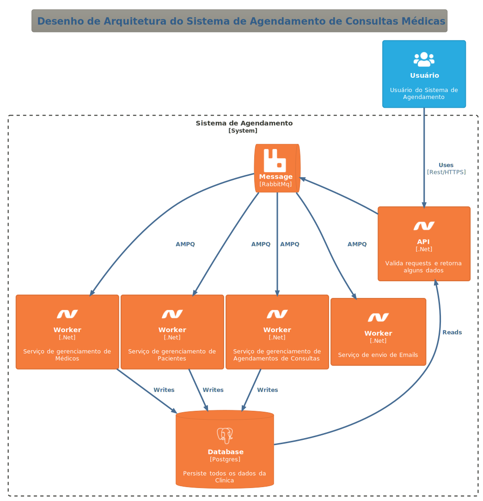

# Sistema de Agendamento de Consultas Médicas #

## Requisitos Funcionais Obrigatórios ##

- Os(as) pacientes devem ser capazes de criar e gerenciar contas
pessoais.
- Os(as) pacientes devem ser capazes de agendar, reagendar ou cancelar
consultas.
- Os(as) médicos(as) devem ser capazes de visualizar e gerenciar suas
agendas de consultas.
- Deve haver um sistema de notificação para lembrar pacientes de suas
consultas. Estas notificações podem ser via e-mail.

## Outros Requisitos Funcionais ##

- Um médico terá apenas 1 especialidade (Simplificação).
- Cada consulta tem uma duração fixa de 30 minutos.
- O padrão para exibição do horário das consultas é xxhxx, ex: 07h30, 18h00, etc.
- O horário para agendamento de consultas é de Segunda a Sábado das 08h00 até às 20h00.
- UMa consulta não pode ser excluída, apenas cancelada.
- O endereço dos pacientes será simplificado.
- Foi adicionado 2 endpoints para retornar os pacientes do banco, um pelo Id do paciente e outro que retorna uma lista de pacientes paginada.
- Foi adicionado 1 endpoint que simula um login de paciente, ele usar o email e uma senha que apenas não pode ficar vazia. Este endpoint retorna o Id do paciente.

## Requisitos Não Funcionais Obrigatórios ##

- O sistema deve ser desenvolvido utilizando C# e .NET.
- A interface do usuário fica a critério do(a) estudante.
- O sistema deve ter um fluxo de delete lógico não físico.
-
## Outros Requisitos Não Funcionais ##

- Classes, métodos e outras partes em Inglês.
- ORM: EF.
- Message Broker: RabbitMQ.

## Arquitetura ##

- Microserviços.
- Serivços:
  - Main: Entrada da Aplicação com Endpoints HTTP REST.
  - Base: Padrões adotados ao longo do projeto por todos os módulos.
  - Pacients: Gerenciamento de pacientes.
  - Doctors: Gerenciamento dos médicos e especialidades.
  - Schedulings - Gerenciamento das consultas, criação, atualização, cancelamentos.
- Cada módulo será desacoplado e terá comunicação assíncrona com os demais, com exceção do módulo Base que poderá ser usado com qualquer outro módulo.
- Cada módulo terá como arquitetura padrão Clean Architecture. O módulo Base não terá arquitetura definida.
- Será usado algumas patterns de DDD como agregados e contextos delimitados conforme a necessidade.
- A persistência de dados será implementada com o pattern Repository.
- A criação dos objetos será feito com o pattern Factory dentro de suas respectivas classes.
- Na medida do possível cada classe implementará todas as suas regras de negócios e validações.
- As validações dos Dtos será feita na camada Application do módulo Main.

##  Como subir o sistema usando Docker ##

Dentro da pasta principal do projeto (onde está o arquivo CLinica.sln) existe o compose do projeto.

Basta digitar o comando:
```
docker compose up [-d]
```

A partir daí o sistema irá subir e através de cada endpoint poderá ser feita a chamada para usar cada serviço disponível.

O Arquivo swagger.json contem todas as definições dos endpoints.

Ao rodar o projeto com o Visual Studio, temos o UI do Swagger que expões toda a documentação dos endpoints.

Dentro do compose podemos passar as configurações do Postgres e do RabbitMq, embora no sistema esteja configurado também nos appsettings de cada serviço.

Para fazer a configuração do servidor smtp para receber os e-mails gerados pelo sistema é necessário alterar o arquivo appsettings.json na pasta Clinica.Send_Emails.Worker. Já está pré configurado para utilizar o serviço gratuito MailTrap (https://mailtrap.io/home), sendo que o usuário necessita apenas adicionar o token da sua conta, e, lembrando que este serviço só aceita enviar e-mails para a conta de e-mail usada durante o registro (na conta gratuita).

## Desenho da Arquitetura ##

